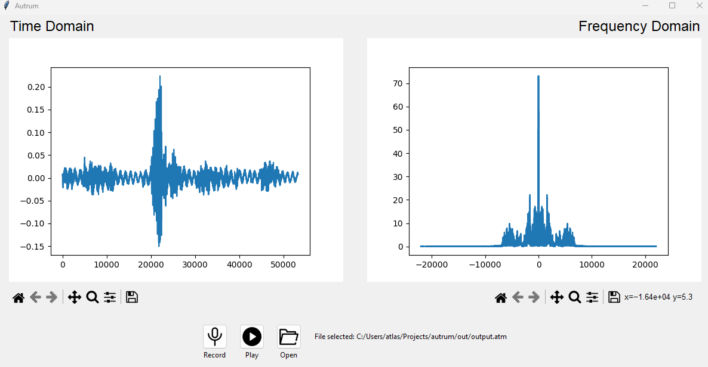

# autrum

This project porpoise is to stream and visualize real-time audio data in time and frequency domains. It uses the scipy library to capture audio from the user's microphone, processes the data, and displays the results using matplotlib.

## Installation

To install the dependencies for this project, run the following command:

```
pip install -r requirements.txt
```

## Usage

To run the project, run the main.py script:

```
python main.py
```

This will initialize the UI that has two graphs, one for time domain and one for the frequency one. You can use the toolbar beneath the graphs to perform functions like zoom-in zoom-out


The UI has three main buttons, record audio, open saved atm files, and playback those files:


The play button will be disabled until a file is selected

This is how the app looks:


## Know problems

- When replaying saved atm files, the graphs will be drawn instantly, not in real-time how its expected. The cause of the problem, audio thread was having problems updating the canvas (which was on the main thread); also, performance issues.
- When recording audio the user can't pause and resume the recording, it has to stop the recording and start a new one.

## Why are the members' voices different?

Some physical characteristics of the vocal cords like length, thickness, and tension have impact on the frequency result of them speaking, causing this difference. The medium in which the voice is propagated also can affect the result.

## References

- Python Software Foundation. (2021). [Tkinter 8.6 documentation](https://docs.python.org/3/library/tkinter.html)

- Python Software Foundation. (2020). [The Python Language Reference](https://docs.python.org/3/reference/index.html)
- Python Basics. (n.d.). [Tkinter tutorial](https://pythonbasics.org/tkinter/)

- SciPy developers. (2021). [SciPy Reference Guide](https://docs.scipy.org/doc/scipy/reference/index.html)

- sounddevice developers. (2023). [Play a Sound File - sounddevice Documentation](https://python-sounddevice.readthedocs.io/en/0.4.6/examples.html#play-a-sound-file)

- sounddevice developers. (2021). [sounddevice documentation](https://python-sounddevice.readthedocs.io/en/0.4.1/)

- Tanenbaum, A. (2003). [Computer Networks. 4th edition](https://www.pearson.com/us/higher-education/product/Tanenbaum-Computer-Networks-4th-Edition/9780130661029.html)

- Virtanen, P., Gommers, R., Oliphant, T. E., et al. (2020). [SciPy 1.0: fundamental algorithms for scientific computing in Python](https://www.nature.com/articles/s41592-019-0686-2). Nature Methods, 17(3), 261-272
